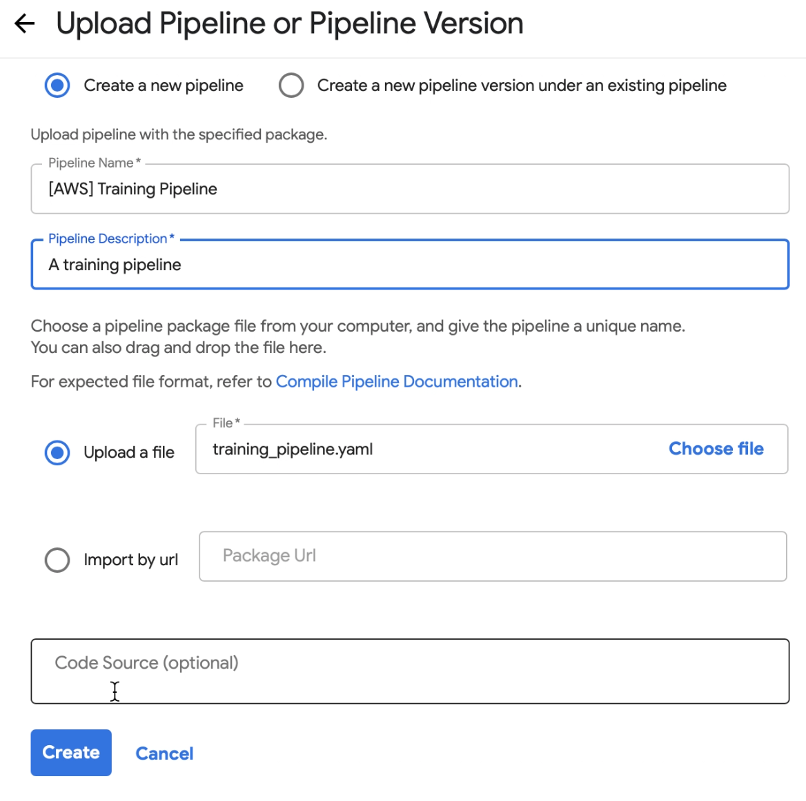
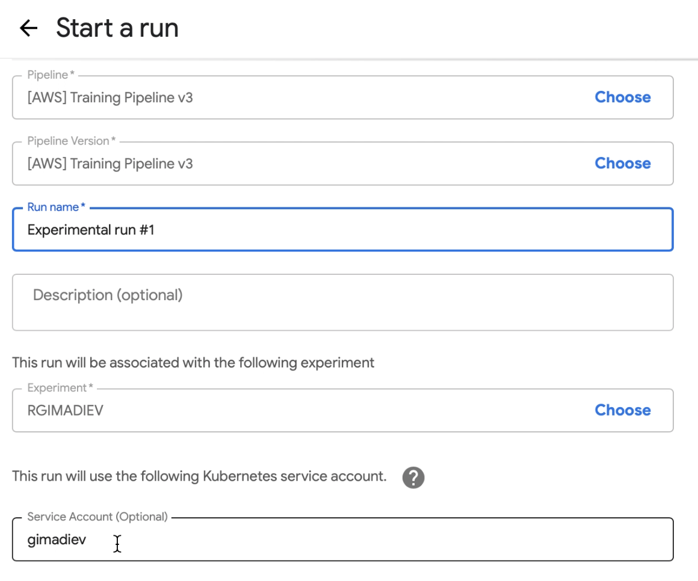

# Quickstart: Deploy Kubeflow on AWS EKS with Terraform

[](https://join.slack.com/t/swiss-army-kube)

<!-- Swiss-Army-Kube-Kubeflow_README -->
**[README](./README.md)** • **[Swiss Army Kube (umbrella repository)](https://github.com/provectus/swiss-army-kube)** • **[Provectus](https://provectus.com/)**

## Overview

This repository is a template of a Kubeflow EKS cluster for your ML projects. Modify the `main.tf` file to set up a cluster, deploy it to AWS with Terraform commands and manage with ArgoCD UI/CLI (or `kubectl`) and Terraform. This simple yet powerful workflow allows you to quickly configure, provision, and replicate multiple dedicated ML-ready Kubeflow Kubernetes clusters (with different settings of variables, networks, Kubernetes versions, etc.).

## Quickstart Contents

1. [Prerequisites](#prereqs)
    + [AWS Account and IAM user](#awsacc)
    + [AWS CLI](#awscli) 
    + [Terraform ](#terraform) 
2. [Cluster Configuration](#clusterconfig)
3. [Cluster Deployment](#clusterserve)
4. [Cluster Access and Management](#clusteraccess)

<br>

<a name="prereqs"></a>
## 1. Install Prerequisites

First, fork and clone this repository. Next, create/install the following prerequisites. 

<a name="awsacc"></a>
### Create an AWS Account and IAM User

- If you don't have an AWS account and IAM user yet, please use this [official guide](https://docs.aws.amazon.com/polly/latest/dg/setting-up.html).

<a name="awscli"></a>
### Install AWS CLI

- Install AWS CLI using this [official guide](https://docs.aws.amazon.com/cli/latest/userguide/cli-chap-install.html). 

<a name="terraform"></a>
### Install Terrafrom

- Install Terraform using this [official guide](https://learn.hashicorp.com/tutorials/terraform/install-cli).

<br>

<a name="clusterconfig"></a>
## 2. Configure Your Cluster 

To set up your cluster, modify the following configuration files as you need: 

- `backend.hcl`
- `main.tf`

### Configure `backend.hcl`

`backend.hcl` is a backend configuration file that stores the Terraform state. 

Example configuration of `backend.hcl`: 

``` hcl
bucket         = "bucket-with-terraform-states"
key            = "some-key/kubeflow-sandbox"
region         = "region-where-bucket-placed"
dynamodb_table = "dynamodb-table-for-locks"
```

### Configure `main.tf`
The minimal required set of variables you need to configure your Kubeflow EKS cluster is shown in the example below and consists of the following: 

- `mainzoneid`

- `domains`

- `admin_arns`

- `cert_manager_email`

- `cognito_users`


Exaple configuration of `main.tf`: 

``` hcl
terraform {
  backend s3 {}
}

module "sak_kubeflow" {
  source = "git::https://github.com/provectus/sak-kubeflow.git?ref=init"

  cluster_name = "simple"

  owner      = "github-repo-owner"
  repository = "github-repo-name"
  branch     = "branch-name"

  #Main route53 zone id if exist (Change It)
  mainzoneid = "id-of-route53-zone"

  # Name of domains aimed for endpoints
  domains = ["sandbox.some.domain.local"]

  # ARNs of users who will have admin permissions.
  admin_arns = [
    {
      userarn  = "arn:aws:iam::<aws-account-id>:user/<username>"
      username = "<username>"
      groups   = ["system:masters"]
    }
  ]

  # Email that would be used for LetsEncrypt notifications
  cert_manager_email = "info@some.domain.local"

  # An optional list of users for Cognito Pool
  cognito_users = [
    {
      email    = "qa@some.domain.local"
      username = "qa"
      group    = "masters"
    },
    {
      email    = "developer@some.domain.local"
      username = "developer"
    }
  ]

  argo_path_prefix = "examples/simple/"
  argo_apps_dir    = "argocd-applications"
}
```

In most cases, you'll need to override variables related to the GitHub repository (such as `repository`, `branch`, `owner`) in the `main.tf file.

<br>

<a name="clusterserve"></a>
## 3. Deploy Your Cluster to AWS 

Deploy your configured cluster with the following terraform commands: 

``` bash
terraform init --backend-config backend.hcl
terraform apply
aws --region <region> eks update-kubeconfig --name <cluster-name>
```

What these commands do: 
- Initialize Terraform with the backend file and download all remote dependencies 
- Create a cluster and a clean EKS with all required AWS resources (IAM roles, ASGs, S3 buckets, etc.) 
- Update your local `kubeconfig` file to access your newly created EKS cluster in the configured context 
 

After that, you can manage your Kubernetes cluster with either ArgoCD CLI/UI or `kubectl`. 

To use `kubectl` Kubernetes CLI for cluster management, install and configure it using this [official guide](https://kubernetes.io/docs/tasks/tools/install-kubectl/).

<br>

<a name="clusteraccess"></a>
## 4. Cluster Access and Management 

### Prepare to start using your cluster

Terraform commands will generate a few files in the default `apps` folder of the repository. You need to commit them in Git and push them to your Github repository to start deploying services to your EKS Kubernetes cluster. 

Note that ArgoCD is pre-configured to track changes of the current repository. When new changes come to the `apps` folder, it triggers the synchronization process and all objects placed in that folder get created.

### Access Kubeflow and ArgoCD UI

By default, two endpoints for accessing services will be created:
- ArgoCD   `https://argocd.some.domain.local`
- Kubeflow `https://kubeflow.some.domain.local`

To access these URLs, configure Cognito User Pool with the name that matches your cluster name.
Your login credentials will be emailed to the address you set up in the `cognito_users` in `main.tf`. 

To get started with Kubeflow and ArgoCD please refer to the respective official documentation: 
- [Kubeflow](https://www.kubeflow.org/docs/pipelines/pipelines-quickstart/)
- [ArgoCD](https://argoproj.github.io/argo-cd/)

## Kubeflow use example
After successfully login into EKS cluster (via kubectl) and Kubeflow UI and passing all configuration windows you can start using all its functionality. Initially a few demo pipelines available, but you can upload your own with advanced usage of AWS and Kubeflow.


Please follow the [official Kubeflow documentation](https://github.com/akartsky/pipelines/tree/documents/samples/contrib/aws-samples) to starting work with AWS. For simplifying this start you can use a demo module with one of the built-in AWS Sagemaker algorithms. For that need to create a folder for managing seaparate Terrafrom state with resourcers related to pipeline executions and add the `main.tf` file with the follow content:
``` hcl
module kmeans_mnist {
  source = "path/to/kmeans-mnist-pipeline/folder/at/root/of/the/project"

  cluster_name = "<your-cluster-name>"
  username     = "<your-kubeflow-username>"
}
```
After this change need execute Terraform:
``` bash
terraform init
terraform apply
```
Terraform will generate `training_pipeline.yaml` file that you can upload to Kubflow through UI.



Now you have your first pipeline and prepared ServiceAccount that match your Kubeflow username, with the required permissions for AWS, please specify it on creating run.



